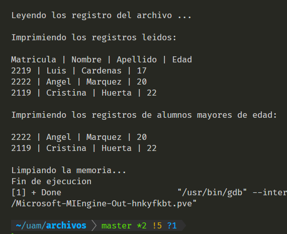

<h1 align="center"> Proyecto Programación Estructurada</h1>

<!-- Improved compatibility of back to top link: See: https://github.com/othneildrew/Best-README-Template/pull/* -->
<a name="readme-top"></a>
<!--
*** Thanks for checking out the Best-README-Template. If you have a suggestion
*** that would make this better, please fork the repo and create a pull request
*** or simply open an issue with the tag "enhancement".
*** Don't forget to give the project a star!
*** Thanks again! Now go create something AMAZING! :D
-->
<!-- TABLE OF CONTENTS -->
<details>
  <summary>Contenido</summary>
  <ol>
    <li>
      <a href="#descripcion">Descripcion</a>
      <ul>
        <li><a href="#herramientas-utilizadas">Herramientas Utilizadas</a></li>
      </ul>
    </li>
    <li>
      <a href="#getting-started">Getting Started</a>
      <ul>
        <li><a href="#prerequisites">Prerequisites</a></li>
        <li><a href="#installation">Installation</a></li>
      </ul>
    </li>
    <li><a href="#usage">Usage</a></li>
    <li><a href="#roadmap">Roadmap</a></li>
    <li><a href="#contributing">Contributing</a></li>
    <li><a href="#license">License</a></li>
    <li><a href="#contact">Contact</a></li>
    <li><a href="#acknowledgments">Acknowledgments</a></li>
  </ol>
</details>


<!-- ABOUT THE PROJECT -->
## Descripcion

Este es un proyecto que desarrolle para aplicar como ayudante del departamento de sistemas para el curso de Programacion Estructurada.
Se tienen que dominar todos los temas de la materia para desarrollarlo.
* Algoritmos y Programas
* Diseño de Programas Estructurados
* Ambiente de Desarrollo Unix
* Programación Modular
* Elementos Básicos de un Programa en C
* Estructuras de Decisión
* Estructuras de Repetición
* Arreglos y Estructuras
* Cadenas de Caracteres
* Archivos
  
### Herramientas Utilizadas

* [](https://en.wikipedia.org/wiki/C_(programming_language))
* [](https://en.wikipedia.org/wiki/Visual_Studio_Code)
* [](https://en.wikipedia.org/wiki/Text_file)


<p align="right">(<a href="#readme-top">back to top</a>)</p>


<!-- GETTING STARTED -->
## Instrucciones
Sigue estos pasos para ejecutar el proyecto

### Prerequisitos
Necesitas tener instalado un compilador de C, recomiendo <a href="https://gcc.gnu.org/">gcc</a>.
<br>
Ya viene instalado en la vasta mayoría de distribuciones de GNU/Linux
* gcc
  ```sh
  sudo apt install gcc -y
  ```
### Instalación

* Clona el repositorio
   ```sh
   git clone https://github.com/aldairuam-azc/ayudantia.git
   ```
* Compila el codigo
   ```sh
   gcc main.c -o main
   ```
* Ejecutalo
   ```sh
   ./main
   ```

<p align="right">(<a href="#readme-top">back to top</a>)</p>


<!-- USAGE EXAMPLES -->
## Ejemplo

Si todo salió bien, debería de verse así.



<p align="right">(<a href="#readme-top">back to top</a>)</p>


<!-- CONTACT -->
## Contacto

Aldair Avalos - [@AldairAvalos8](https://twitter.com/AldairAvalos8) - al2222005685@azc.uam.mx

Link del Proyecto: [https://github.com/aldaiuam-azc/ayudantia](https://github.com/aldaiuam-azc/ayudantia)

<p align="right">(<a href="#readme-top">back to top</a>)</p>
